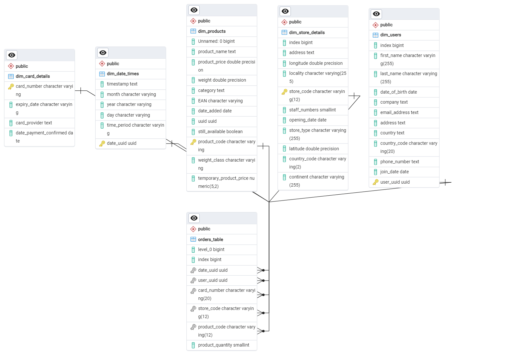

# Multinational Retail Data Centralisation Project
Overview
This project is aimed at centralising data from different sources for a retail company. The project involves extracting data from multiple databases, cleaning, transforming the data and then uploading the cleaned data into a database for querying.

- [Installation](#installation)
- [File Structure](#file-structure)
- [Configuration](#configuration)
- [Usage](#usage)
- [License](#license)

## Installation
If unsure how to clone a repository 
 [follow this guide](https://docs.github.com/en/repositories/creating-and-managing-repositories/cloning-a-repository )

To set up the project, follow these steps:

1. **Clone the repository**:
   ```bash
   git clone https://github.com/TDAYENI/multinational-retail-data-centralisation771.git

   cd multinational-retail-data-centralisation771

2. **Install the Environment from the Text File**
    
    The text file can be found in the environments folder

    Navigate to the directory containing the environment.yml file
    ```bash
    cd /path/to/directory
    ````
    
3. **Specify a name for the new environment during creation**
    ````bash
    conda env create -f environment.yml -n new_env_name
4. **Activate new env**
    ````bash
    conda activate myenv
    ````

## File Structure

````kotlin 
multinational-retail-data-centralisation/
├── SQL/
│   ├── alter_statements.sql
│   ├── drop_statements.sql
│   ├── erd_diagram.png
│   ├── primary_and_foreign_key.sql
│   ├── t1_how_many_Stores_.sql
│   ├── t2_most_stores.sql
│   ├── t3_month_largest_sale.sql
│   ├── t4_on_vs_offline.sql
│   ├── t5_total_percent_per_store.sql
│   ├── t6_month_highest_cost.sql
│   ├── t7_staff_headcount.sql
│   ├── t8_ger_stores.sql
│   └── t9_speed_of_sales.sql
├── data_cleaning.py
├── data_extraction.py
├── database_utils.py
├── main.py
├── README.md
└── environment.yml
````

The project directory contains the following key files and directories:

* main.py: The main script that orchestrates the data extraction, cleaning, and uploading processes.
* data_extraction.py: Contains methods for extracting data from various sources such as RDS databases, PDFs, APIs, and S3 buckets.
* data_cleaning.py: Contains methods for cleaning data, including replacing null values, converting date formats, and cleaning numeric data.
* database_utils.py: Contains methods for managing database connections and uploading data to databases.
* SQL/: Directory containing SQL scripts for database operations.
* requirements.txt contains the dependecies for a virtual environment.


## Configuration
Database Credentials
Database credentials are stored in YAML files located in the cred directory. Ensure you have created these files with the correct database details.

**Example db_creds.yaml:**
```yaml
database:
  host: your_host
  port: your_port
  user: your_username
  password: your_password
  database_name: your_database_name
````
## Database Credentials
Database credentials are stored in YAML files located in the cred directory. Ensure you have created these files with the correct database details.

Example pg_admin_creds.yaml:
````yaml
pgadmin:
  host: your_host
  port: your_port
  user: your_username
  password: your_password
````

# Usage 

### Running the Main Script to Create Databases

1. **Set Up the Environment:**
    - Ensure you have Conda installed. Create and activate the environment using the `environment.yml` file shown in [Installation](#installation).


2. **Update Database Credentials:**
    - Update the `cred/pg_admin_creds.yaml` path in main.py script with your PostgreSQL database credentials as well as API keys and headers.

3. **Run the Main Script:**
    - The `main.py` script is used to create and set up the databases.
    ```sh
    python main.py
    ```

### Running SQL Scripts

1. **Database Management and Analysis:**
    - Use your preferred SQL client to connect to your database.
    - Execute the SQL scripts located in the `SQL/` directory to manage and analyze your database.

    Example SQL scripts:
    - `alter_statements.sql`: Contains SQL statements to alter existing database structures.
    - `drop_statements.sql`: Contains SQL statements to drop database objects.
    - `primary_and_foreign_key.sql`: Defines primary and foreign key constraints.
    - `t1_how_many_Stores_.sql` to `t9_speed_of_sales.sql`: Various analysis queries to gather insights from the database.




# License
